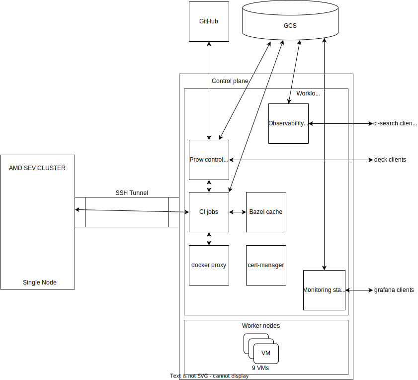

# AMD SEV Cluster
This is a single node cluster provided by AMD to help with the testing of KubeVirt and [SEV](https://developer.amd.com/sev/) (Secure Encrypted Virtualization). This cluster is treated as an external kubernetes provider for KubeVirt CI. KubeVirt is installed directly on the cluster and tests can be run against it. Nested virtualization is currently not supported with SEV and this is one of the reasons for treating this cluster as an external cluster provider. 

The prow control-plane cluster is used to run the prowjobs that cover the SEV testing. 


## Layout


As the cluster is only available remotely over SSH, an SSH tunnel is required to access the Kubernetes API which is listening on the private interface of the node. A tool such as [sshuttle](https://github.com/sshuttle/sshuttle) allows the prowjob pod on the Prow control-plane cluster to access the Kubernetes API of the AMD SEV cluster. The SSH key and kubeconfig are stored in the KubeVirt secrets repository.


## Automated SEV tests
A [periodic prowjob](https://github.com/kubevirt/project-infra/blob/287514a66695bc2f06885c7d979e31e9cdece629/github/ci/prow-deploy/files/jobs/kubevirt/kubevirt/kubevirt-periodics.yaml#L629) and an optional [presubmit prowjob](https://github.com/kubevirt/project-infra/blob/287514a66695bc2f06885c7d979e31e9cdece629/github/ci/prow-deploy/files/jobs/kubevirt/kubevirt/kubevirt-presubmits.yaml#L2425) are available to carry out automated testing of SEV. These test lanes treat the AMD cluster as an external provider by setting `KUBEVIRT_PROVIDER="external"`.

## Hardware Details
- Two 64 Core AMD EPYC (Rome) CPUs (support for SEV and SEV-ES)
- 1TB RAM
- 3TB Local NVME Storage
- Extract from `/proc/cpuinfo`
```
processor	: 254
vendor_id	: AuthenticAMD
cpu family	: 23
model		: 49
model name	: AMD EPYC 7742 64-Core Processor
stepping	: 0
microcode	: 0x8301055
cpu MHz		: 2250.000
cache size	: 512 KB
physical id	: 1
siblings	: 128
core id		: 62
cpu cores	: 64
apicid		: 253
initial apicid	: 253
fpu		: yes
fpu_exception	: yes
cpuid level	: 16
wp		: yes
flags		: fpu vme de pse tsc msr pae mce cx8 apic sep mtrr pge mca cmov pat pse36 clflush mmx fxsr sse sse2 ht syscall nx mmxext fxsr_opt pdpe1gb rdtscp lm constant_tsc rep_good nopl nonstop_tsc cpuid extd_apicid aperfmperf pni pclmulqdq monitor ssse3 fma cx16 sse4_1 sse4_2 x2apic movbe popcnt aes xsave avx f16c rdrand lahf_lm cmp_legacy svm extapic cr8_legacy abm sse4a misalignsse 3dnowprefetch osvw ibs skinit wdt tce topoext perfctr_core perfctr_nb bpext perfctr_llc mwaitx cpb cat_l3 cdp_l3 hw_pstate ssbd mba ibrs ibpb stibp vmmcall fsgsbase bmi1 avx2 smep bmi2 cqm rdt_a rdseed adx smap clflushopt clwb sha_ni xsaveopt xsavec xgetbv1 xsaves cqm_llc cqm_occup_llc cqm_mbm_total cqm_mbm_local clzero irperf xsaveerptr wbnoinvd amd_ppin arat npt lbrv svm_lock nrip_save tsc_scale vmcb_clean flushbyasid decodeassists pausefilter pfthreshold avic v_vmsave_vmload vgif v_spec_ctrl umip rdpid overflow_recov succor smca sme sev sev_es
bugs		: sysret_ss_attrs spectre_v1 spectre_v2 spec_store_bypass retbleed
bogomips	: 4472.83
TLB size	: 3072 4K pages
clflush size	: 64
cache_alignment	: 64
address sizes	: 43 bits physical, 48 bits virtual
power management: ts ttp tm hwpstate cpb eff_freq_ro [13] [14]
```

## Software Details
- RHEL 8.7
- Kernel 4.18.0-425.3.1.el8.x86_64
- cri-o v1.26.1
- Kubernetes v1.26.1
