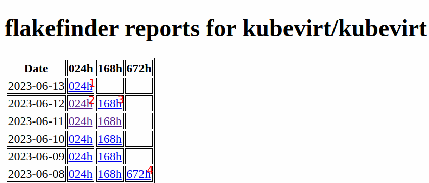
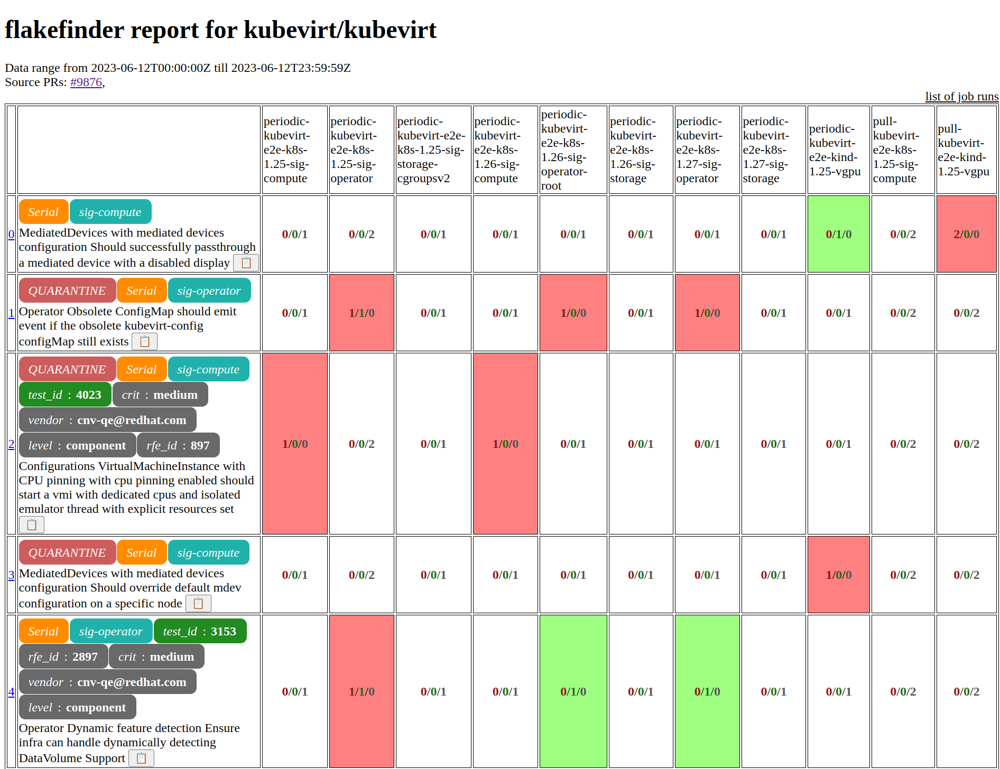
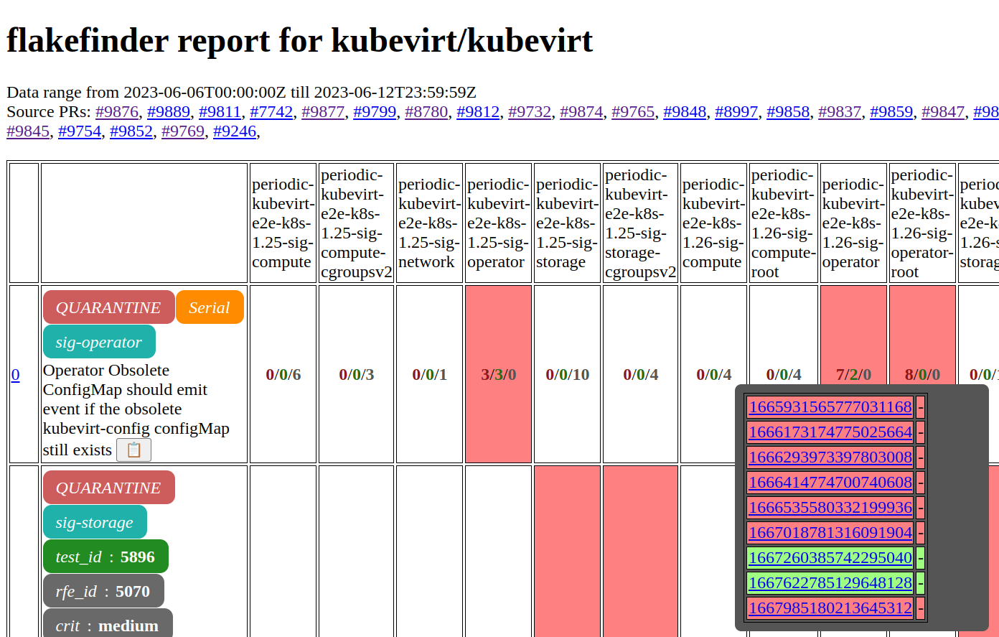
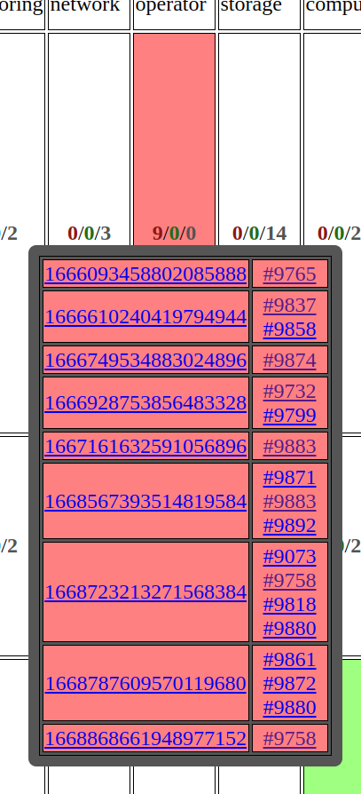

# FlakeFinder reports

The FlakeFinder reports only report test failures from merged code to keep false positives at a minimum.

For the KubeVirt project there's an additional rolling report, the top most report on 24h column is the rolling window report updated hourly.

For all other projects the daily reports are generated shortly after midnight, weekly/monthly depending on schedule.

See the [entry page](https://storage.googleapis.com/kubevirt-prow/reports/flakefinder/index.html)  for all reports generated for KubeVirt organization

## Example: kubevirt/kubevirt overview

1. daily rolling window report (updated hourly), covers **all PRs merged today**
2. daily report for yesterday, covers **all PRs merged yesterday**
3. weekly report from yesterday, covers **all PRs merged from six days before yesterday until yesterday**
4. flakefinder reports for last four weeks (updated once a week)

Flakefinder aggregates reports over **failed tests for commits of merged PRs** by date for the number of repositories that are using it.

### Flakefinder reports per project

Contains the index of recent reports for a project.

### FlakeFinder report details page

In a nutshell the daily report of day x covers all merged PRs from the start of the day before until the runtime of the report. (Runtime of the reports can be found [here](https://prow.ci.kubevirt.io/?job=*flakefinder*).)

Each report contains rows for all tests where at least one test failed on any lane for all PRs that were merged at or after the report date. Rows are sorted according to severity of test failures (i.e the more test fails, the more the test appears at the top of the report).

| Column No | Content |    
|-----------| -------     |
| 1         | test name |
| 2 ...     | lane 1 - x |

| Colored numbers | Meaning      |
|-----------------|--------------|
| red             | no of fails  |
| green           | no of passes |
| gray            | no of skips |

### FlakeFinder report job popup

When you click on any of the numbers inside the job rows, a popup will open that shows the job runs that are part of the report.

If you click on the cell for periodic jobs the popup will look like this:

Failed job runs are marked as red. The links of the left row lead to the Prow job details page of the job run.

If you click on the cell for presubmit jobs the popup will look like in the below image.

Please note the difference of the cells on the right side: There's always one link to a pull request, but sometimes more than one.

If there's more than one PR linked, this job run has been a batch run issued by [Tide]. In a batch run multiple pull requests are tested at once.

See also:
* [FlakeFinder README](https://github.com/kubevirt/project-infra/tree/main/robots/flakefinder#readme)

[Flakefinder reports]: https://storage.googleapis.com/kubevirt-prow/reports/flakefinder/index.html
[Tide]: https://docs.prow.k8s.io/docs/components/core/tide/
