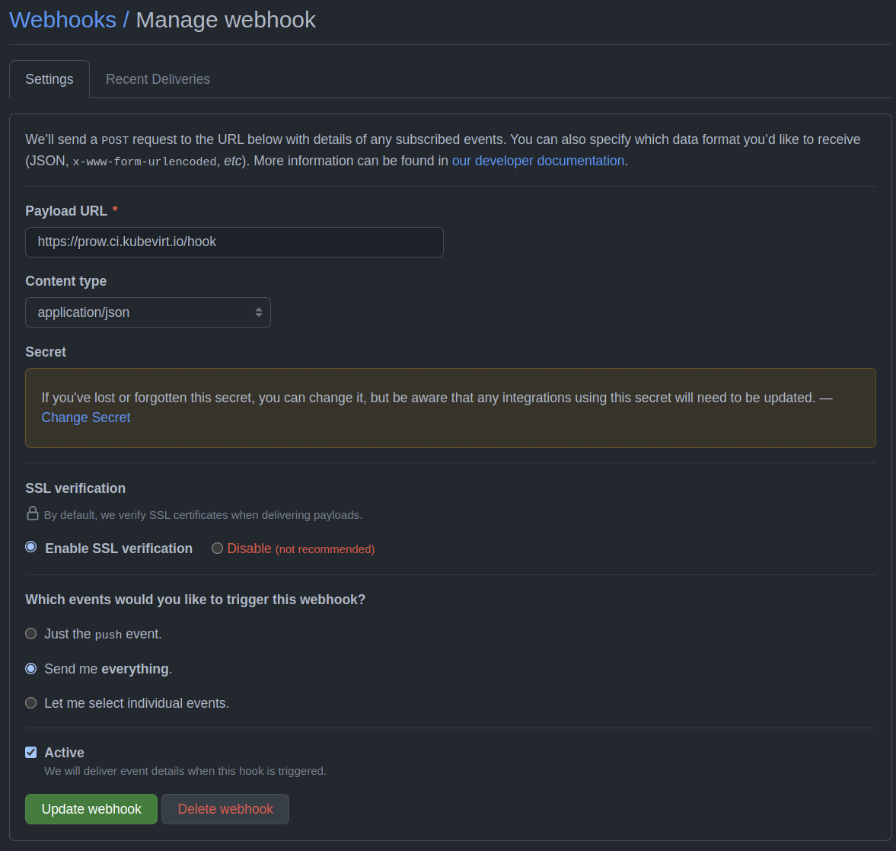

How to onboard a repository to KubeVirt Prow
============================================

Prow needs to be able to act on your repository, thus it requires at least write access. For this to work you need to invite [kubevirt-bot](https://github.com/kubevirt-bot) to your repository. This is a GitHub account we use for all CI matters. Also a webhook needs to get added to your repository, so that it sends back signals to Prow. The webhook configuration management is [automated](https://github.com/kubevirt/project-infra/blob/cdbbd894dfa7b9d4ab01139c7119e8dd54dfcc04/github/ci/prow-deploy/tasks/deploy.yml#L53), see configuration [here](https://github.com/kubevirt/project-infra/blob/0216025282ce2edb3feb15cd601bab1fdd253084/github/ci/prow-deploy/kustom/base/configs/current/config/config.yaml#L584). _See below if you do not want Prow to manage the webhook._ 

_Note: Depending on what features you want to use, it might even be necessary to add it as an administrator. But write access should be enough for a start._

If you want Prow to run jobs for your repo, you should have a look at the [jobs folder](https://github.com/kubevirt/project-infra/tree/main/github/ci/prow-deploy/files/jobs) first. There we store the configuration for what jobs to run when. In a nutshell you should create
* **a presubmit** if you want a job to be run whenever a commit is pushed to a PR
* **a postsubmit** to run after a merge to a branch and
* **a periodic** if you want to run something on a regular basis, i.e. cron or fixed interval.

See the resources section for documentation on how to configure Prow jobs.

Also we need to configure at least the trigger plugin to make the jobs run when a commit is pushed. Here's an [example for nmstate repo](https://github.com/kubevirt/project-infra/tree/main/github/ci/prow-deploy/kustom/base/configs/current/plugins/plugins.yaml).

You might also consider using lgtm, approve and tide, which would give you automatic merges when the PR has the right labels. Finally branch protection would enhance your CI signal enabling tide to consider which jobs are required to pass for merge and which are only optional. [Here's the docs](https://github.com/kubevirt/community/blob/main/docs/add-merge-automation-to-your-repository.md).

As a side note: we also [manage the org, repo and team configuration](https://github.com/kubevirt/community/blob/main/docs/automating-github-org-management.md) with prow.

Manual prow webhook configuration
---------------------------------

Further resources
-----------------
* KubeVirt CI
  * [Documentation](https://github.com/kubevirt/project-infra/tree/main/docs) (maintainers, infra overview)
  * [Prow Deployment overview](https://github.com/kubevirt/project-infra/tree/main/github/ci/prow-deploy#kubevirt-prow-deployment)
  * [Prow configuration repository](https://github.com/kubevirt/project-infra/)
  * [Deck - the prow ui](https://prow.ci.kubevirt.io/)
* kubernetes/test-infra
  * [Prow docs](https://github.com/kubernetes/test-infra/blob/master/prow/)
  * [Life Of A Prow Job](https://github.com/kubernetes/test-infra/blob/master/prow/life_of_a_prow_job.md)
  * [How To Configure New Jobs](https://github.com/kubernetes/test-infra/blob/master/prow/jobs.md#how-to-configure-new-jobs)
