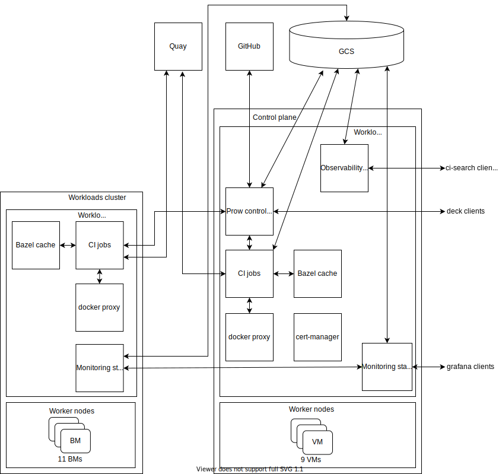

# Infrastructure components

We describe here the elements that form the infrastructure required for projects
under KubeVirt's umbrella. This mainly involves components required to run our
CI/CD systems and related services, like the monitoring stack or applications for
indexing and querying build logs.

The CI/CD system is based on [Prow], kubernetes CI system. For a brief overview
of how Prow runs jobs take a look at ["Life of a Prow Job"]. To see common Prow
usage and interactions flow, see the pull request interactions [sequence diagram].

## Layout

## Prow clusters

Our infrastructure includes several clusters connected directly to Prow, in other
words, Prow can schedule jobs on them. they will be described next, For each of
them this document provides the following fields:

* Prow context: context name of the cluster in the master kubeconfig used by Prow
to access it. It is also the value of the `cluster` field in the Prow jobs that
run on the cluster. The main kubeconfig is part of the [automation secrets], read
more about the [build clusters configuration here].
* Components: which workloads run in the cluster, according to the layout picture
above.
* External services: functionality not running in our infra that is required for
the normal operation of the workloads running in the cluster.
* Connected clusters: for each cluster, which others are required for its normal
operation.
* Exposed services: functionality accessible from outside the cluster, usually as
web applications.

### Control plane

The control plane cluster is a managed cluster on IBM cloud, we only need to care
about the worker nodes. It runs the main components of the infrastructure and
several non-e2e Prow jobs.

#### Context
ibm-prow-jobs

#### Components

* Prow control plane: all the Prow components, including the main microservices
(crier, deck, hook, horologium, prow-controller-manager, tide, sink), several
external plugins (rehearse, release-blocker) and secondary components
(cherrypicker, gcsweb, ghproxy, label-sync, needs-rebase, prow-exporter,
pushgateway, statusreconciler).

* Monitoring stack: prometheus with thanos sidecar, node-exporter, grafana and
thanos (query-frontend, query, store and compact).

* Bazel cache ([greenhouse]) speeds up the builds that use bazel.

* [ci-search]: allows us to query CI build logs.

* [docker proxy]: acts as a cache for docker images, reducing the need to access
external registries.

* [cert-manager]: manages TLS certificates for our web services (grafana, ci-search
and deck).

#### External services

* GitHub: Prow receive messages from GH webhooks about events like comments or PR
created. It also sends information about jobs' status and actions to issue comments
or merge PRs.

* GCS: we use buckets to store:
  * Prow build results
  * Build artifacts
  * Thanos blocks

* Quay: we mainly use quay as our container image registry, the images used for
testing and the image artifacts are stored here.

* slack: some notifications are sent to a specific slack channel.

#### Connected clusters

* Workloads, the control plane schedules CI jobs on it.

#### Exposed services

* deck: Prow UI, available at https://prow.ci.kubevirt.io

* grafana: available at https://grafana.ci.kubevirt.io

* ci-search: available at https://search.ci.kubevirt.io

### Workloads

This is a self managed cluster with bare metals as workers. It runs the e2e jobs.

#### Context

prow-workloads

#### Components

* Monitoring stack: prometheus with thanos sidecar and node-exporter

* Bazel cache ([greenhouse]) speeds up the builds that use bazel.

* [docker proxy]: acts as a cache for docker images, reducing the need to access
external registries.

#### External services

* GCS: we use buckets to store:
  * Build artifacts
  * Thanos blocks

* Quay: we mainly use quay as our container image registry, the images used for
testing and the image artifacts are stored here.

#### Connected clusters

Control plane, it sends prow jobs here to be executed and retrieves its state.

#### Exposed services

None.

## External KubeVirtCI clusters

There are several clusters that are also used to run jobs, but in this case
using the external provider feature of KubeVirtCI. The jobs are scheduled in one
of the Prow Clusters described above and during the execution they connect to an
external cluster and run tests on it. There are several considerations to take
into account:
* The jobs won't create an independent KubeVirtCI cluster, so for each cluster
only one job can be run concurrently.
* The credentials to access the cluster in the form of a kubeconfig filemust be
provided separately, they are not included in Prow's main kubeconfig.

### ARM cluster

Used to run ARM test jobs.

### Performance cluster

Runs [performance-related jobs](performance-cluster.md).

[Prow]: https://github.com/kubernetes/test-infra/tree/master/prow#readme
["Life of a Prow Job"]: https://github.com/kubernetes/test-infra/blob/master/prow/life_of_a_prow_job.md
[sequence diagram]: https://raw.githubusercontent.com/kubernetes/test-infra/master/prow/docs/pr-interactions-sequence.svg?sanitize=true
[ci-search]: https://github.com/openshift/ci-search
[docker proxy]: https://github.com/rpardini/docker-registry-proxy
[cert-manager]: https://cert-manager.io/docs/
[greenhouse]: https://github.com/kubernetes/test-infra/tree/master/greenhouse
[automation secrets]: https://github.com/kubevirt/secrets/blob/master/secrets.tar.asc
[build clusters configuration here]: ./how-to-add-a-prow-cluster.md
