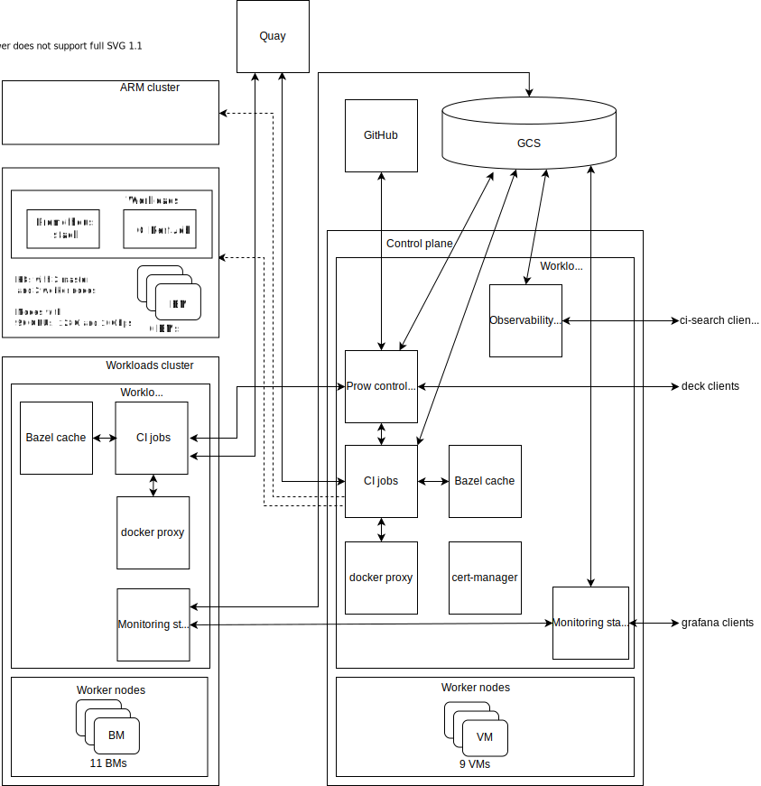

# Performance Cluster
Code changes may affect system behavior, scalability, and performance. So we currently have two types of tests needed to validate kubevirt code. These are:
* Correctness tests - e2e tests verifying expected system behaviors
* Performance tests - e2e tests to test system performance

Correctness tests run as unit and functional tests for each PR, and performance tests run burst density tests on a dedicated cluster in isolation to continually test builds for performance improvements and regressions. Therefore, performance testing constitutes the final layer of protection against regressions.

## Layout

## Prow cluster
The CI/CD system for performance testing is based on [Prow], a Kubernetes CI system, using the same control plane system as the Correctness tests. Therefore, all test statuses can be viewed in the same testgrid.

However, unlike Correctness tests, Performance testing jobs do not use KubeVirtCI, which creates a Kubernetes cluster in a virtual machine. Instead, a pre-built cluster on top of baremetal nodes is used due to performance reasons. Most speacilly because we want to avoid the performance implications of nested virtualization. Moreover, unlike Correctness tests, only one Performance test job can run at a time to avoid performance interference from workload collocation.

## Automated performance cluster tests
Because running performance tests is time consuming, we do not want to run them too often. On the other hand, performing them infrequently implies late identification and accumulation of regressions. Note that they would not run by default on every open PR due to resource, costs, and other constraints. So, we choose the following middle ground:

| Day | |
| ------------- |:-------------:| 
| Mon | [100 VMs density perf test](../github/ci/prow-deploy/files/jobs/kubevirt/kubevirt/kubevirt-periodics.yaml#L791)  @ 04:41 AM UTC   [scale VMs density perf test](../github/ci/prow-deploy/files/jobs/kubevirt/kubevirt/kubevirt-periodics.yaml#L878)  @ 03:41 PM UTC |
| Tue | 100 VMs density perf test  @ 04:41 AM UTC   scale VMs density perf test  @ 03:41 PM UTC |
| Wed | 100 VMs density perf test  @ 04:41 AM UTC   scale VMs density perf test  @ 03:41 PM UTC |
| Thu | 100 VMs density perf test  @ 04:41 AM UTC   scale VMs density perf test  @ 03:41 PM UTC |
| Fri | 100 VMs density perf test  @ 04:41 AM UTC   scale VMs density perf test  @ 03:41 PM UTC |
| Sat | 100 VMs density perf test  @ 04:41 AM UTC   scale VMs density perf test  @ 03:41 PM UTC |
| Sun | 100 VMs density perf test  @ 04:41 AM UTC   scale VMs density perf test  @ 03:41 PM UTC |

Running a performance jobs every day would:
* help capture regressions daily
* help verify fixes with low latency
* ensure a good release signal

## Test configuration
* The 100 VM density perf test is a prow job that runs a small scale burst density performance test once a day by creating 100 VMIs in the performance cluster, wait for all to be in the running state, collect metrics and delete them all.
Testgrid [link](https://testgrid.k8s.io/kubevirt-periodics#periodic-kubevirt-performance-cluster-100-density-test&width=20).

* Scale VM density perf test is a prow job that runs a medium scale burst density performance test once a day creating 400, 600, up to 800 VMIs in the performance cluster. 
Waiting for a cool down interval between each scenario. We create up to 200 VMIs per node to avoid overload the node, more info [here](https://2022.fosdem.sojourner.rocks/event/12559).
Testgrid [link](https://testgrid.k8s.io/kubevirt-periodics#periodic-kubevirt-performance-cluster-scale-density-test&width=20).

## Metrics
To analyze the performance regression, we are interested in latency, throughput, and resource utilization metrics. To this end, we continually collect and report on the measurements described above as part of the project testing framework.

### **VM/VMI end-to-end latency**
KubeVirt provides high-level abstractions for users to represent their applications, for example using virtual machine (VM) objects or virtual machine instance (VMI) objects. Where VM are stateful objects that can be stopped and started and VMI represents the basic ephemeral building block of an instance. Note that a VM object can create a VMI object. For the simplicity sake, the CI/CD performance test currently only evaluates the VMI object, but we plan to extend it in the future.

Therefore, the most important metric is the VMI creation latency, which directly impacts the end-user experience.
The VMI creation latency is measured from the time the object is created to the time the VMI object enters in the Running phase. A running VMI means the libvirt domain has been created and the virtual machine OS is booting. So while knowing whether the OS is fully booted or [whether the network is accessible](https://github.com/kubevirt/kubevirt/pull/5946) are also important metrics, they do not depend on the KubeVirt control plane. Hence, these aspects are not being evaluated in CI/CD performance tests at this time.

### **API responsiveness for user-level abstractions**
Another important metric is the tail latency for KubeVirt API operations. The 99th percentile of all API calls should return in less than 1s.

### **VM/VMI creation rate (throughput)**
A high creation rate is crucial for scalability, on a large scale system the system throughput will affect the overall performance. Throughput is measured as the number of VMI running per second.

## Cluster Configuration
The cluster is a Kubernetes cluster managed on baremetal nodes in the IBM cloud. For the software layer, the cluster is configured with Kubernetes 1.21.3, where each node has CentOS Linux 8. The Kubernetes cluster consists of 3 master nodes and 3 worker nodes, the etcd cluster runs in the master nodes. 

Regarding the hardware configuration, all nodes are homogeneous, with 2 Intel(R) Xeon(R) Platinum 8260 CPUs @ 2.40GHz where each processor has 24 cores and 2 hyper-threads per core, thus with a total of 96 CPUs. In addition, each node has 128GB of DRAM, 10Gbps network bandwidth, and 1.6T of SCSI disk.

## Components
* Load generator: [perfscale-load-generator](https://github.com/kubevirt/kubevirt/tree/main/tools/perfscale-load-generator), which is a tool aimed at stressing the Kubernetes and KubeVirt control plane by creating several objects (e.g., VM, VMI, and VMIReplicaSet).

* Monitoring stack: prometheus, node-exporter, and grafana. 
   * Prometheus retains data for up to 3 months.
   * Various dashboards including a KubeVirt control-plane dashboard.

## Exposed services

* deck: "periodic-kubevirt-performance-cluster-100-density-test" and  "periodic-kubevirt-performance-cluster-scale-density-test" jobs in Prow UI, available at https://prow.ci.kubevirt.io

* grafana: available at http://52.117.69.106:30000/d/V1Qq_IBM_za0/kubevirt-control-plane

* ci-search: available at https://search.ci.kubevirt.io

## Contact

Please join our community and help us build the future of KubeVirt! There are many ways to participate. If you’re particularly interested in perfoamcne and scalability, you’ll be interested in: 

* Joining the scalability “Special Interest Group”, which meets every Thursday at 7 AM Pacific Time at [Zoom meeting](https://zoom.us/j/96406344036). Calendar information [here](https://calendar.google.com/calendar/u/0/embed?src=kubevirt@cncf.io&ctz=GMT).
* Chat with us on Slack via [#virtualization](https://kubernetes.slack.com/?redir=%2Farchives%2FC8ED7RKFE) or [#kubevirt-dev](https://kubernetes.slack.com/archives/C0163DT0R8X) @ kubernetes.slack.com
* Discuss with us on the [kubevirt-dev Google Group](https://groups.google.com/forum/#!forum/kubevirt-dev)

[Prow]: https://github.com/kubernetes/test-infra/tree/master/prow#readme
[docker proxy]: https://github.com/rpardini/docker-registry-proxy
