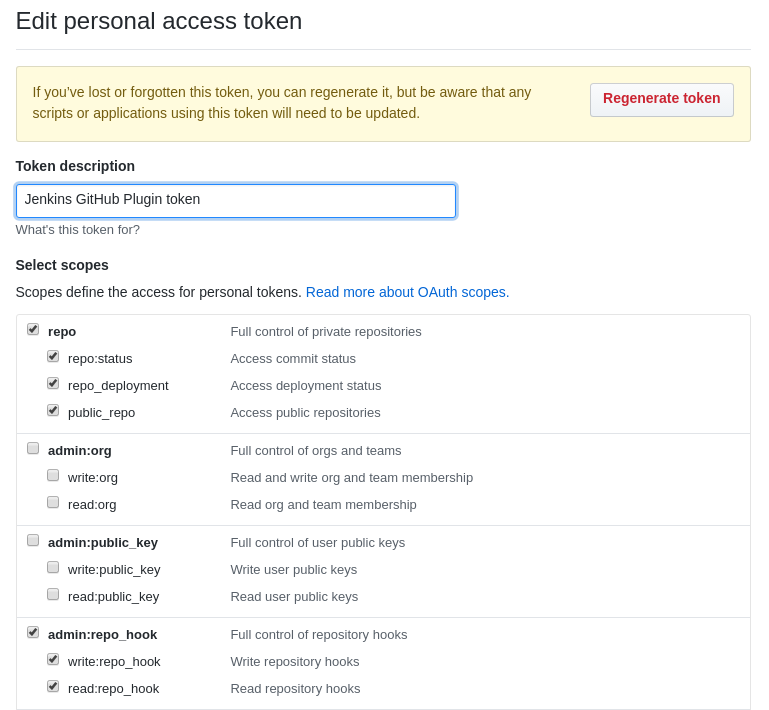

# kubevirt-ci

Ansible based description of the KubeVirt CI environment for functional tests.
The ansible roles here allow to recrate and scale the Jenkins CI environment
used.

## Prepare your Github Project

1. create an access token with the following permissions.



2. add your Bot to your github project.
3. register the Jenkins callback URL in your github project

 * Fill in your callback URL (e.g. `http://myjenkins.com:1234/ghprbhook/`)
 * Content-type should be `application/x-www-form-urlencoded`
 * Add a secret
 * Enable `Push`, `Pull request`, `Issue comment` notifications

## Prepare your Ansible Variables

Create a file `group_vars/all/main.yml` based on

```
---
jenkinsUser: "jenkins"
jenkinsPass: "mypwd"
master: "http://my.jenkins.com:8080"
slaveSlots: 1
githubSecret: ""
githubCallbackUrl: "http://my.jenkins.com:8080"
githubToken: "453f86e8a6c9eed45789c689089e1eb2w9x2fda3"
githubRepo: "rmohr/kubevirt"
```

There you can fill in you token, your secret and the Jenkins callback URL.

## Scaling

To add new workers, a client role exists. It uses the Jenkins Swarm plugin to
attach it to the Jenkins master.

## Run the playbook

Add your master and your clients to the `hosts` file:

```
[jenkins-master]
master ansible_host=my.jenkins.com ansible_user=root

[jenkins-slaves]
slave0 ansible_host=slave0.my.jenkins.com ansible_user=root
slave1 ansible_host=slave1.my.jenkins.com ansible_user=root
```

Provision your maschines:

```
ansible-playbook -i hosts ci.yaml
```

## KubeVirt CI Landscape specifics

There exists an additional `beaker.yaml` playbook. It is not generalized, and
allows us the increase in all our beaker managed servers, to increase the LVM
volumes to the maximum available size. The resulting extra LVM volume, is then
used as the default storage location for all libvirt related images.
