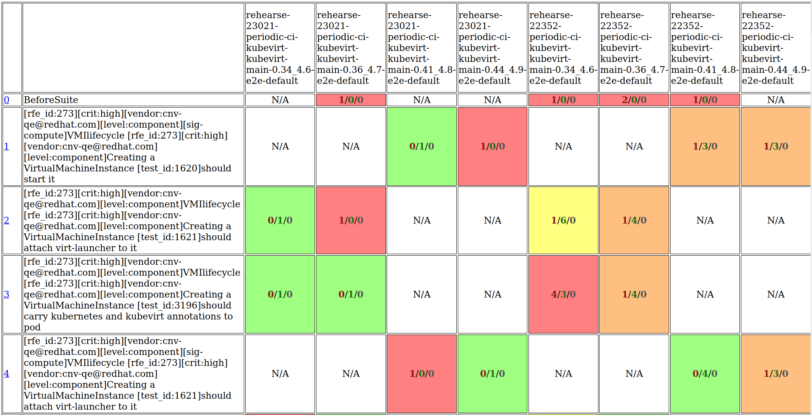
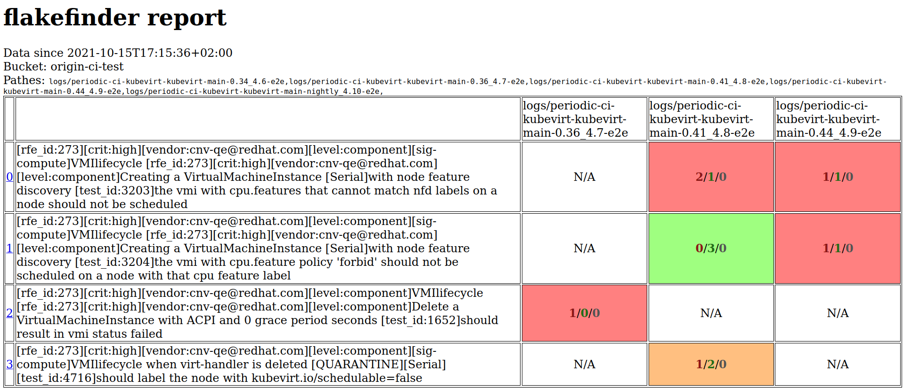

flake-report-creator
====================

uses the flakefinder logic of creating reports for a set of ci builds for either prow or jenkins in order to generate a matrix of flakiness over several runs of several jobs.

For prow it just iterates over the GCS job directories, for jenkins it fetches the artifacts from builds for selected jobs.

Either way it tries to find junit files and returns a report of the aggregated data.

This tool enables a user to create an ad-hoc report of any GCS directories that contain kubevirt testing junit files, in turn enabling a report over unrelated or just selected PRs, or a selected set of periodic jobs. The user needs to make sure whether that makes sense of course 😏

Usage note
----------

**Job results older than two weeks are skipped by default. Use `--startFrom` argument to extend the range to older results**

Usage for Prow
--------------

**Note: env var `GOOGLE_APPLICATION_CREDENTIALS` is required to be set to a valid service account credentials file, otherwise the access to GCS will not work!**

**Example 1:** we want to create a report from job runs of two PRs on openshift-ci.  But we want to skip all jobs that don't match a certain regular expression.

*NB1: we use `start-from` here as some test results would have been skipped, as this was a quite long running PR*
*NB2: we use `subDirRegex` here to filter out other unimportant jobs (openshift-ci related validation checks i.e)*

```bash
$ ./hack/flake-report-creator.sh prow --ci-system=openshift --presubmits 22352,23021

...
2021/10/29 12:57:54 main.go:216: writing output file to /tmp/flakefinder-3764038013.html
```

Result: 

**Example 2:** we want to create a report over a set of selected pull requests for kubevirtci,
but we only want to see the e2e jobs.

The default values will create a report for the last 14 days.

```bash
$ ./hack/flake-report-creator.sh prow --ci-system=kubevirt --presubmits 6812,6815,6818
...
2021/10/29 17:24:49 main.go:242: writing output file to /tmp/flakefinder-3053258374.html
```

Result: 

**Example 3:** we want to create a report over a set of periodics on openshift-ci.

The default values will create a report for the last 14 days.

```bash
$  ./hack/flake-report-creator.sh prow --ci-system=openshift --periodics 0.34,0.36,0.41,4.10
...
2021/10/29 16:39:54 main.go:241: writing output file to /tmp/flakefinder-1095073378.html
```

Result: 

**Example 4:** we want to create a report over a set of selected periodics for kubevirtci.

The default values will create a report for the last 14 days.

```bash
$ ./hack/flake-report-creator.sh prow --ci-system=kubevirt --periodics 1.21,1.22

...
INFO[0118] Skipping test results before 2021-10-15 17:22:50.286379347 +0200 CEST m=-1209599.993786708 for logs/periodic-kubevirt-e2e-k8s-1.20-sig-storage/1449002154302902272 in bucket 'kubevirt-prow' 
2021/10/29 17:24:49 main.go:242: writing output file to /tmp/flakefinder-3053258374.html
```

Result: 

Usage for Jenkins
-----------------

**Example 1:** we want to create a report over all kubevirt test jobs from jenkins for the default CNV versions (currently 4.10) over the last 14 days.

```bash
$ ./hack/flake-report-creator.sh jenkins
```

**Example 2:** we want to create a report over the compute and network jobs from jenkins for the default CNV versions over the last 24 hours.

```bash
$ ./hack/flake-report-creator.sh jenkins --startFrom=24h --jobNamePattern='^test-kubevirt-cnv-4\.10-(compute|storage)-ocs$'
```
