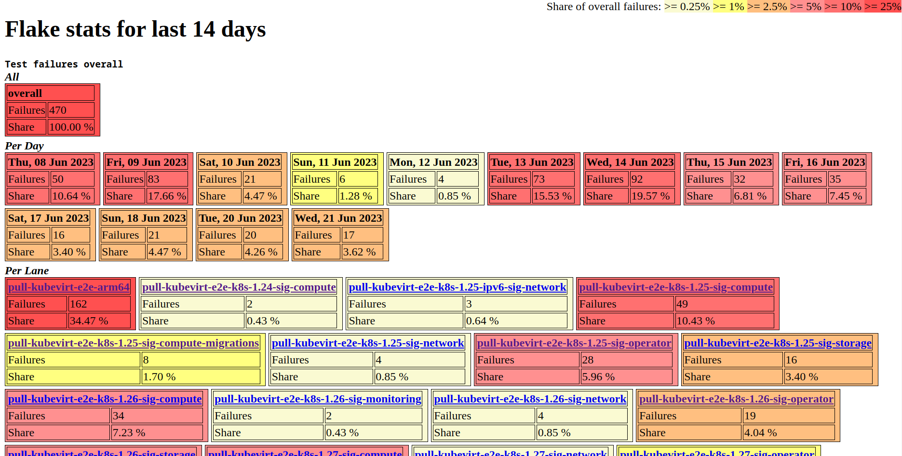
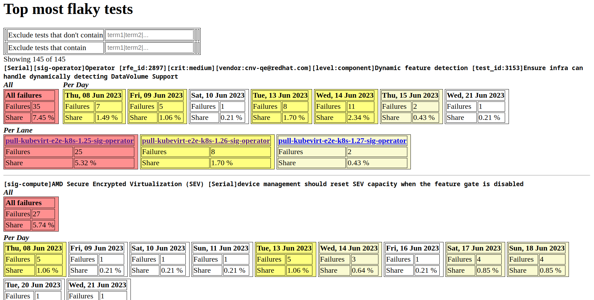

# flake-stats

`flake-stats` is a go tool that aggregates the flakefinder stats for a given time frame set with `days-in-the-past` and then generates an html page from the aggregates. Goal is to have a more condensed picture of where flakes are impacting us the most. Thus the aggregate values are colored as a heat map, where depending on their share of all failures, the redder the card is.

The html file has two sections, the overall aggregates and the per test aggregates.

# Overall aggregates

Overall aggregates section shows the total test failures for the time frame. It shows the totals overall, totals per day and totals per lane for the given time frame.

# Per test aggregates

Per test aggregates section shows the test failures for all tests that had failures in PR runs during the time frame.

Each row shows the totals overall, totals per day and totals per lane. At the top of the section below the header there are two filter fields that adjust which tests are shown.

If any test has been seen to have been in QUARANTINE during the reporting period, the row will have a grey background.

## Sorting of per test aggregates

Tests are sorted by most recent failures descending, which means that tests with more recent failures appear before tests with less recent failures.

In the picture you can see that the upper test has a set of adjacent failures from Sat - Tue with a total of 8 failures (2 + 2 + 2 + 2) (red border), where the test below that has a set of adjacent failures from Mon - Tue with a total of two (1 + 1)  (red border).
The blue bordered and the green bordered per day failures are non-recent sets that are neglected when sorting.

