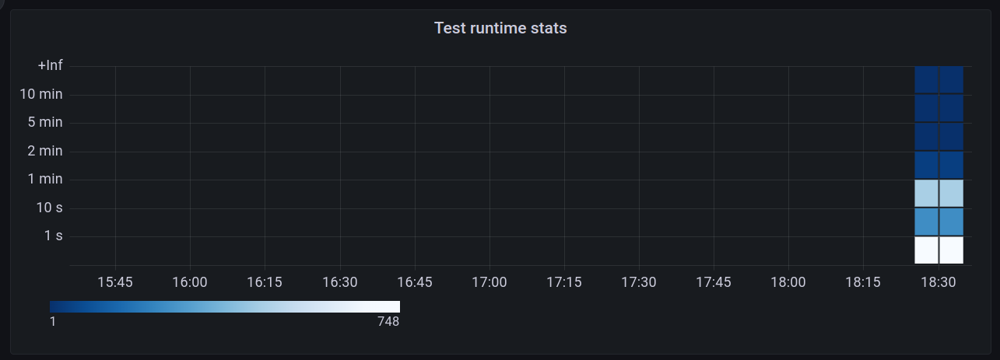

# push-test-metrics

Pushes the test runtimes as metrics to a push-gateway, so that we can visualize the test runtimes in a grafana dashboard.

## How it works

Fetches the latest run from the given periodic job, downloads the `junit.xml` from the job run, and parses the file.

Then Histogram `ci_test_runtime_seconds_total` (so we have buckets of test runtimes) and Summary `ci_test_runtime_seconds` per test are created. From these we can create panels to show test runtimes and heatmaps.

