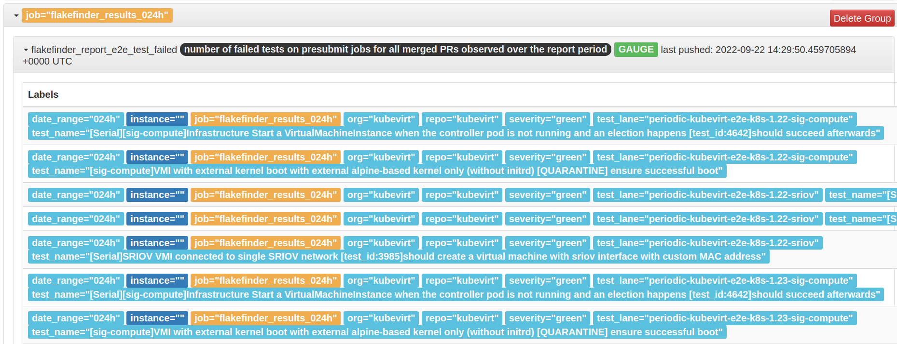

# push-flakefinder-results

Fetches the flakefinder result csv file from the previous day from the gcs bucket url, converts test failures, success and skips into gauge values and the pushes them to a prometheus [pushgateway].

Example metrics from the pushgateway:

[pushgateway]: https://github.com/prometheus/pushgateway
